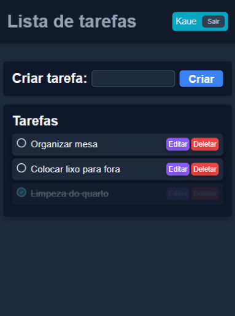

# Task Manager Full Stack

Aplicação Full Stack para gerenciamento de tarefas com autenticação JWT, desenvolvida com React, Node.js, Express e MySQL.

## Demonstração

Frontend: https://task-manager-fullstack-rho-lilac.vercel.app/

Backend: https://task-manager-fullstack-ckbo.onrender.com/

## Tecnologias Utilizadas

### Frontend

* React
* React Router
* Vite

### Backend

* Node.js
* Express
* JWT Authentication
* bcrypt

### Banco de Dados

* MySQL (Aiven Cloud)

### Deploy

* Vercel (Frontend)
* Render (Backend)
* Aiven (Banco de Dados)

## Funcionalidades

* Cadastro de usuários
* Login com autenticação JWT
* Logout
* Rotas protegidas
* Criação de tarefas
* Edição de tarefas
* Exclusão de tarefas
* Alteração de status (Pendente/Concluída)

## Screenshots

### Login


### Cadastro


### Lista de Tarefas



## Arquitetura Técnica (Resumo)

Fluxo resumido do sistema:

1. **Frontend (React)** → envia requisições HTTP com JWT.
2. **Routes (Express)** → definem endpoints e aplicam middleware de autenticação.
3. **Controllers** → recebem requisições, chamam Services e retornam respostas.
4. **Services** → lógica de negócio: CRUD de tarefas, toggle status, login/logout.
5. **Banco de Dados (MySQL/Aiven)** → armazena usuários e tarefas.

Visual rápido:

👤 Usuário → 🖥️ Frontend → 🚪 Routes → 🧩 Controllers → ⚙️ Services → 💾 MySQL → 🔙 Resposta

## Variáveis de Ambiente

### Backend

```env
DB_HOST=
DB_PORT=
DB_USER=
DB_PASSWORD=
DB_NAME=

JWT_SECRET=
JWT_EXPIRES_IN=
```

### Frontend

```env
VITE_API_URL=
```

## Como Executar Localmente

### Backend

```bash
npm install
npm start
```

### Frontend

```bash
npm install
npm run dev
```

## Autor

Kaue
